# FastAPI Tracing with Jaeger through OpenTelemetry

Trace FastAPI with [Jaeger](https://www.jaegertracing.io/) through [OpenTelemetry Python API and SDK](https://github.com/open-telemetry/opentelemetry-python).

The span from the application could be collected with [Jaeger Collector](https://www.jaegertracing.io/docs/1.47/architecture/#collector)(jaeger-collector) or [OpenTelemetry Collector](https://www.jaegertracing.io/docs/1.47/architecture/#with-opentelemetry)(otel-collector):

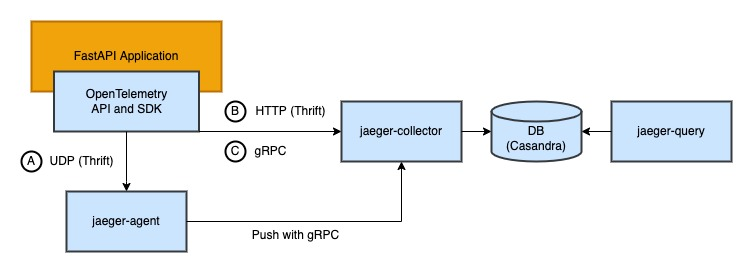

There are four ways to push span:

- A: Push span to OpenTelemetry Collector with gRPC (Port: 4317)
- B: Push span to OpenTelemetry Collector over HTTP (Port: 4318)
- C: Push span to Jaeger Collector with gRPC (Port: 4317)
- D: Push span to Jaeger Collector with HTTP (Port: 4318)

In this architecture, OpenTelemetry Collector is an agent to collects, processes, and sends data to Jaeger Collector. Jaeger Collector is responsible for collecting span and writing span to DB, then Jaeger Query queries data from DB.

Jaeger Agent has been deprecated since version 1.43. Since version 1.43, OpenTelemetry SDK allows direct data transmission to Jaeger Collector or utilization of OpenTelemetry Collector as an Agent. If you still want to utilize Jaeger Agent for span collection, please refer to the previous version of this [project](https://github.com/blueswen/fastapi-jaeger/tree/jaeger-agent).

## Table of contents

- [FastAPI Tracing with Jaeger through OpenTelemetry](#fastapi-tracing-with-jaeger-through-opentelemetry)
  - [Table of contents](#table-of-contents)
  - [Quick Start](#quick-start)
  - [Detail](#detail)
    - [FastAPI Application](#fastapi-application)
      - [Traces and Logs](#traces-and-logs)
      - [Trace information](#trace-information)
      - [Span Inject](#span-inject)
    - [Jaeger](#jaeger)
      - [Jaeger Collector](#jaeger-collector)
      - [OpenTelemetry Collector](#opentelemetry-collector)
      - [Storage](#storage)
      - [Jaeger Query](#jaeger-query)
  - [With Service Performance Monitoring](#with-service-performance-monitoring)
    - [Quick Start](#quick-start-1)
    - [Details](#details)
      - [OpenTelemetry Collector](#opentelemetry-collector-1)
      - [Prometheus](#prometheus)
      - [Jaeger Query](#jaeger-query-1)
  - [With Grafana and Loki](#with-grafana-and-loki)
    - [Quick Start](#quick-start-2)
    - [Explore with Grafana](#explore-with-grafana)
      - [Traces to Logs](#traces-to-logs)
      - [Logs to Traces](#logs-to-traces)
    - [Detail](#detail-1)
      - [Jaeger - Traces](#jaeger---traces)
        - [Grafana Data Source](#grafana-data-source)
      - [Loki - Logs](#loki---logs)
        - [Loki Docker Driver](#loki-docker-driver)
        - [Grafana Data Source](#grafana-data-source-1)
      - [Grafana](#grafana)
- [Reference](#reference)


## Quick Start

1. Start all services with docker-compose

   ```bash
   docker-compose up -d
   ```

   It may take some time for DB(Cassandra) to initialize. You can run `docker-compose ps` to check the `jaeger-query` status is running when DB is ready as below:

   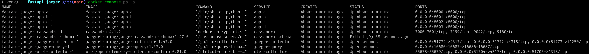

2. Send requests with `curl` to the FastAPI application

   ```bash
   curl http://localhost:8000/chain
   ```

3. Check on Jaeger UI [http://localhost:16686/](http://localhost:16686/)

   Jaeger UI screenshot:

   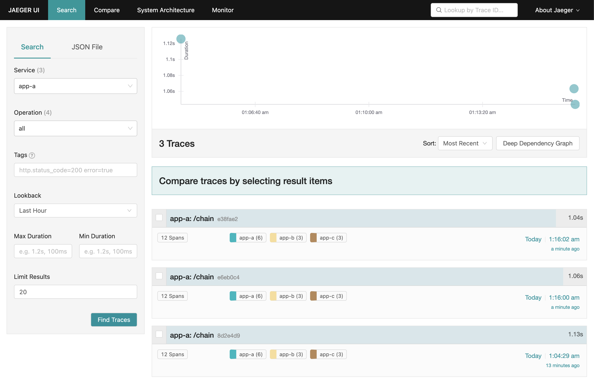

   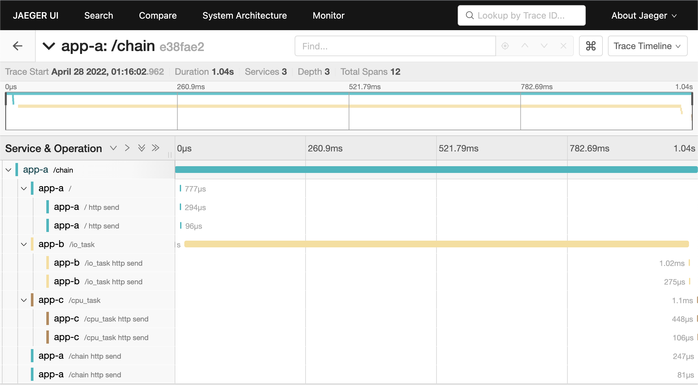

## Detail

### FastAPI Application

For a more complex scenario, we use three FastAPI applications with the same code in this demo. There is a cross-service action in `/chain` endpoint, which provides a good example of how to use OpenTelemetry SDK process span and how Jaeger Query presents trace information.

#### Traces and Logs

Utilize [OpenTelemetry Python SDK](https://github.com/open-telemetry/opentelemetry-python) to send span to Jaeger. Each request span contains other child spans when using OpenTelemetry instrumentation. The reason is that instrumentation will catch each internal asgi interaction ([opentelemetry-python-contrib issue #831](https://github.com/open-telemetry/opentelemetry-python-contrib/issues/831#issuecomment-1005163018)). If you want to get rid of the internal spans, there is a [workaround](https://github.com/open-telemetry/opentelemetry-python-contrib/issues/831#issuecomment-1116225314) in the same issue #831 by using a new OpenTelemetry middleware with two overridden methods of span processing.

Utilize [OpenTelemetry Logging Instrumentation](https://opentelemetry-python-contrib.readthedocs.io/en/latest/instrumentation/logging/logging.html) to apply logger format with trace id and span id.

```py
# fastapi_app/main.py

# otlp-grpc, otlp-http
MODE = os.environ.get("MODE", "otlp-grpc")

OTLP_GRPC_ENDPOINT = os.environ.get("OTLP_GRPC_ENDPOINT", "jaeger-collector:4317")
OTLP_HTTP_ENDPOINT = os.environ.get(
    "OTLP_HTTP_ENDPOINT", "http://jaeger-collector:4318/v1/traces"
)

def setting_jaeger(app: ASGIApp, log_correlation: bool = True) -> None:
    # set the tracer provider
    tracer = TracerProvider()
    trace.set_tracer_provider(tracer)

    if MODE == "otlp-grpc":
        tracer.add_span_processor(
            BatchSpanProcessor(
                OTLPSpanExporterGRPC(endpoint=OTLP_GRPC_ENDPOINT, insecure=True)
            )
        )
    elif MODE == "otlp-http":
        tracer.add_span_processor(
            BatchSpanProcessor(OTLPSpanExporterHTTP(endpoint=OTLP_HTTP_ENDPOINT))
        )
    else:
        # default otlp-grpc
        tracer.add_span_processor(
            BatchSpanProcessor(
                OTLPSpanExporterGRPC(endpoint=OTLP_GRPC_ENDPOINT, insecure=True)
            )
        )

    # override logger format which with trace id and span id
    if log_correlation:
        LoggingInstrumentor().instrument(set_logging_format=True)

    FastAPIInstrumentor.instrument_app(app, tracer_provider=tracer)
```

#### Trace information

The instrumentation library will collect trace information automatically, e.g. HTTP status code, HTTP method, HTTP URL, etc. We can also add custom attributes to the span with SDK.

```py
from opentelemetry.sdk.resources import Resource
from opentelemetry.sdk.trace import TracerProvider

resource = Resource.create(attributes={
  "service.name": "fastapi-app",
  "custom.data": "custom_data",
})

tracer = TracerProvider(resource=resource)
```

Or we can use environment variables to set the attributes and service name(the service name displayed on Jaeger UI), which is used in this demo. Following is the example of setting environment variables in the compose file.

```yaml
services:
  app:
    image: ghcr.io/blueswen/fastapi-jaeger/app:latest
    environment:
      OTEL_SERVICE_NAME: "fastapi-app"
      OTEL_RESOURCE_ATTRIBUTES: "custom.data=custom_data"
```

#### Span Inject

If we want other services to use the same Trace ID as the source application, we have to pass the Trace ID to the header of the request. In this demo, we use `inject` function to add current span information to the header. Because OpenTelemetry FastAPI instrumentation only takes care of the asgi app's request and response, it does not affect any other modules or actions like sending HTTP requests to other servers or function calls.

```py
# fastapi_app/main.py

from opentelemetry.propagate import inject

@app.get("/chain")
async def chain(response: Response):
    headers = {}
    inject(headers)  # inject trace info to header

    async with httpx.AsyncClient() as client:
        await client.get(f"http://localhost:8000/", headers=headers,)
    async with httpx.AsyncClient() as client:
        await client.get(f"http://{TARGET_ONE_HOST}:8000/io_task", headers=headers,)
    async with httpx.AsyncClient() as client:
        await client.get(f"http://{TARGET_TWO_HOST}:8000/cpu_task", headers=headers,)

    return {"path": "/chain"}
```

Or we can just use the instrumentation library for [different libraries](https://github.com/open-telemetry/opentelemetry-python-contrib/tree/main/instrumentation#readme). Like [OpenTelemetry HTTPX Instrumentation](https://github.com/open-telemetry/opentelemetry-python-contrib/tree/main/instrumentation/opentelemetry-instrumentation-httpx) or [OpenTelemetry Requests Instrumentation](https://github.com/open-telemetry/opentelemetry-python-contrib/tree/main/instrumentation/opentelemetry-instrumentation-requests) according to the library we use. Following is the example of using OpenTelemetry HTTPX Instrumentation which will automatically inject trace info to the header.

```py
import httpx
from opentelemetry.instrumentation.httpx import HTTPXClientInstrumentor

HTTPXClientInstrumentor().instrument()

@app.get("/chain")
async def chain(response: Response):
    async with httpx.AsyncClient() as client:
        await client.get(f"http://localhost:8000/")
    async with httpx.AsyncClient() as client:
        await client.get(f"http://{TARGET_ONE_HOST}:8000/io_task")
    async with httpx.AsyncClient() as client:
        await client.get(f"http://{TARGET_TWO_HOST}:8000/cpu_task")

    return {"path": "/chain"}
```

### Jaeger

There is an [all-in-one](https://www.jaegertracing.io/docs/1.33/getting-started/#all-in-one) Jaeger for quick testing, but in production running Jaeger backend components as a scalable distributed system is the most common method, as illustrated below.

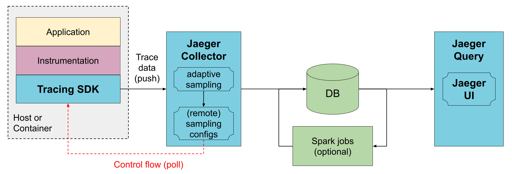

Image Source: [Jaeger](https://www.jaegertracing.io/docs/1.47/architecture/#direct-to-storage)

Or with OpenTelemetry Collector:

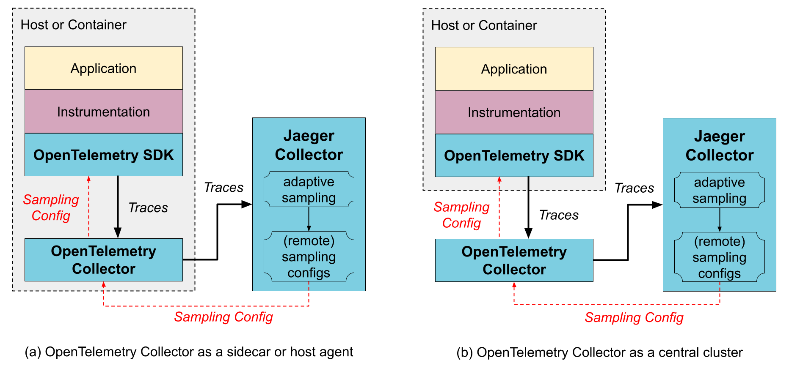

Image Source: [Jaeger](https://www.jaegertracing.io/docs/1.47/architecture/#with-opentelemetry)

We create the Jaeger backend of this demo project based on the [docker compose example](https://github.com/jaegertracing/jaeger/blob/main/docker-compose/jaeger-docker-compose.yml) from Jaeger's official repository.

Check more details on [Jaeger docs about architecture](https://www.jaegertracing.io/docs/1.47/architecture/).

#### Jaeger Collector

The Jaeger collector receives traces from OpenTelemetry SDKs or OpenTelemetry Agent and runs them through a processing pipeline.

```yaml
# docker-compose.yaml
services:
  jaeger-collector:
    image: jaegertracing/jaeger-collector:1.57.0
    command: 
      - "--cassandra.keyspace=jaeger_v1_dc1"
      - "--cassandra.servers=cassandra"
      - "--sampling.initial-sampling-probability=.5"
      - "--sampling.target-samples-per-second=.01"
      - "--collector.otlp.enabled=true"
    environment: 
      - SAMPLING_CONFIG_TYPE=adaptive
    ports:
      - "4317" # accept OpenTelemetry Protocol (OTLP) over gRPC
      - "4318" # accept OpenTelemetry Protocol (OTLP) over HTTP
    restart: on-failure
    depends_on:
      - cassandra-schema
```

Check more details on Jaeger docs [Deployment about Collector](https://www.jaegertracing.io/docs/1.47/deployment/#collector), [CLI flags about Collector](https://www.jaegertracing.io/docs/1.47/cli/#jaeger-collector), and [Sampling](https://www.jaegertracing.io/docs/1.47/sampling/).

#### OpenTelemetry Collector

The OpenTelemetry Collector receives traces from OpenTelemetry SDKs and processes them according to the configuration file `etc/otel-collector-config.yaml`.

```yaml
# docker-compose.yaml
services:
  otel-collector:
    image: otel/opentelemetry-collector-contrib:0.100.0
    command:
      - "--config=/conf/config.yaml"
    volumes:
      - ./etc/otel-collector-config.yaml:/conf/config.yaml
    ports:
      - "4317" # OTLP gRPC receiver
      - "4318" # OTLP http receiver
    restart: on-failure
    depends_on:
      - jaeger-collector
```

```yaml
# etc/otel-collector-config.yaml
receivers:
  otlp:
    protocols:
      grpc:
      http: 

exporters:
  otlp:
    endpoint: jaeger-collector:4317
    tls:
      insecure: true
  otlphttp:
    endpoint: http://jaeger-collector:4318
    tls:
      insecure: true

processors:
  batch:

service:
  pipelines:
    traces:
      receivers: [otlp]
      processors: [batch]
      exporters: [otlp] # export to jaeger-collector:4317
      # exporters: [otlphttp] # export to jaeger-collector:4318
```

Check more details on OpenTelemetry Collector docs [Configuration](https://opentelemetry.io/docs/collector/configuration/).

#### Storage

All traces collected by Jaeger Collector will be validated, indexed, and then stored in storage. Jaeger supports multiple span storage backends:

1. Cassandra 3.4+
2. Elasticsearch 5.x, 6.x, 7.x
3. Kafka
4. memory storage
5. Storage plugin

In this demo, we use Cassandra as the storage backend.

```yaml
# docker-compose.yaml
services:
  # Cassandra instance container
  cassandra:
    image: cassandra:4.1.4

  # initialize Cassandra
  cassandra-schema:
    image: jaegertracing/jaeger-cassandra-schema:1.57.0
    depends_on:
      - cassandra
```

If you want to mitigate the pressure on Cassandra and prevent data loss, you can add Kafka and Jaeger Ingester to the architecture to process data asynchronously. The architecture will look like this:

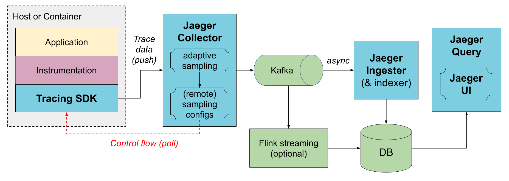

Image Source: [Jaeger](https://www.jaegertracing.io/docs/1.47/architecture/#via-kafka)

There is a [docker compose example](https://github.com/jaegertracing/jaeger/tree/main/docker-compose/kafka) on Jaeger's official repository.

Check more details on Jaeger docs [Deployment about Span Storage Backends](https://www.jaegertracing.io/docs/1.47/deployment/#span-storage-backends).

#### Jaeger Query

The Jaeger Query is a service that retrieves traces from storage and hosts a UI to display them.

```yaml
# docker-compose.yaml
services:
  jaeger-query:
    image: jaegertracing/jaeger-query:1.57.0
    command:
      - "--cassandra.keyspace=jaeger_v1_dc1"
      - "--cassandra.servers=cassandra"
    ports:
      - "16686:16686"
      - "16687:16687"
    restart: on-failure
    depends_on:
      - cassandra-schema
```

Check more details on Jaeger docs [Deployment about Query Service & UI](https://www.jaegertracing.io/docs/1.47/deployment/#query-service--ui).

## With Service Performance Monitoring

Jaeger Service Performance Monitoring become stable since Jaeger 1.43.0. It provides a new way to monitor the performance of services, which extracts the RED (Request, Error, Duration) metrics from span data. The data flow is shown below:

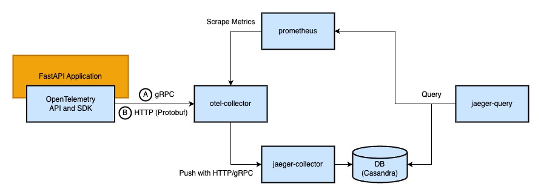

### Quick Start

1. Start all services with docker-compose

   ```bash
   docker-compose -f docker-compose-spm.yaml up -d
   ```

   It may take some time for DB(Cassandra) to initialize. You can run `docker-compose ps` to check the `jaeger-query` status is running when DB is ready.

2. Send requests with [siege](https://linux.die.net/man/1/siege) and curl to the FastAPI app

   ```bash
   bash request-script.sh
   ```

3. Check on Jaeger UI Monitoring tab [http://localhost:16686/monitor](http://localhost:16686/monitor)

   Jaeger UI Monitoring tab screenshot:

   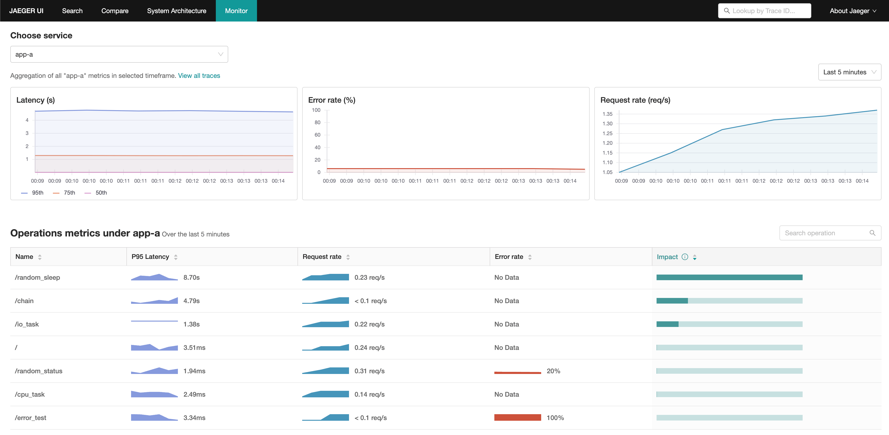

### Details

To enable Service Performance Monitoring, we need to:

1. Add some configurations to OpenTelemetry Collector for extracting RED metrics from span data and exporting them to Prometheus.
2. Create a Prometheus instance to store the metrics.
3. Update Jaeger Query configurations to scrape metrics from Prometheus.

#### OpenTelemetry Collector

The OpenTelemetry Collector receives traces from OpenTelemetry SDKs and processes them according to the configuration file `etc/otel-collector-config-spm.yaml`.

```yaml
# docker-compose-spm.yaml
service:
  otel-collector:
    image: otel/opentelemetry-collector-contrib:0.81.0
    command:
      - "--config=/conf/config.yaml"
    volumes:
      - ./etc/otel-collector-config-spm.yaml:/conf/config.yaml
    ports:
      - "4317" # OTLP gRPC receiver
      - "4318" # OTLP http receiver
      - "8889" # Prometheus metrics exporter
    restart: on-failure
    depends_on:
      - jaeger-collector
```

```yaml
# etc/otel-collector-config-spm.yaml
receivers:
  otlp:
    protocols:
      grpc:
      http: 

exporters:
  otlp:
    endpoint: jaeger-collector:4317
    tls:
      insecure: true
  prometheus:
    endpoint: "0.0.0.0:8889"

connectors:
  spanmetrics:

processors:
  batch:

service:
  pipelines:
    traces:
      receivers: [otlp]
      processors: [batch]
      exporters: [spanmetrics, otlp]
    metrics/spanmetrics:
      receivers: [spanmetrics]
      exporters: [prometheus]
```

To generate metrics from span data, we need to:

1. Add `spanmetrics` to `connectors`: Enable and configure the spanmetrics connector
   1. dimensions: Extract span attributes to Prometheus labels
2. Add `spanmetrics` to traces pipeline `exporters`: Let the traces pipeline export traces to the spanmetrics connector
3. Add `spanmetrics` to metrics pipeline `receivers`: Set the spanmetrics connector as the receiver of the metrics pipeline, and the data is from the traces pipeline exporter
4. Add `prometheus` to metrics pipeline `exporters`: Expose metrics in Prometheus format on port 8889

The pipeline diagram and configuration file are as follows:

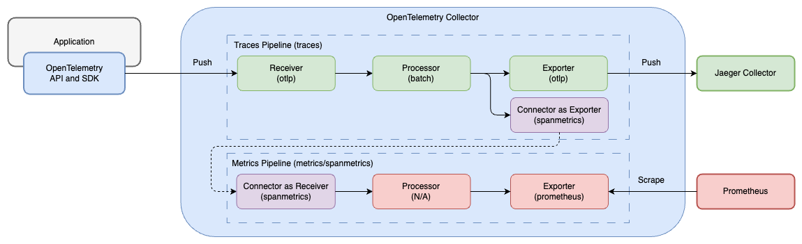

#### Prometheus

Prometheus collects metrics from OpenTelemetry Collector and stores them in its database. The metrics can be scraped by Jaeger Query.

```yaml
# docker-compose-spm.yaml
service:
  prometheus:
    image: prom/prometheus:v2.51.2
    ports:
      - "9090:9090"
    volumes:
      - ./etc/prometheus.yml:/workspace/prometheus.yml
    command:
      - --config.file=/workspace/prometheus.yml
```

```yaml
# etc/prometheus.yml
global:
  scrape_interval:     15s # Set the scrape interval to every 15 seconds. Default is every 1 minute.
  evaluation_interval: 15s # Evaluate rules every 15 seconds. The default is every 1 minute.
  # scrape_timeout is set to the global default (10s).

scrape_configs:
  - job_name: aggregated-trace-metrics
    static_configs:
    - targets: ['otel-collector:8889']
```

#### Jaeger Query

Jaeger Query scrapes metrics from Prometheus and displays them on the Monitoring tab.

```yaml
# docker-compose-spm.yaml
service:
  jaeger-query:
    image: jaegertracing/jaeger-query:1.57.0
    environment:
      - METRICS_STORAGE_TYPE=prometheus
    command:
      - "--cassandra.keyspace=jaeger_v1_dc1"
      - "--cassandra.servers=cassandra"
      - "--prometheus.query.support-spanmetrics-connector=true"
      - "--prometheus.server-url=http://prometheus:9090"
      - "--prometheus.query.normalize-duration=true"
      - "--prometheus.query.normalize-calls=true"
    ports:
      - "16686:16686"
      - "16687:16687"
    restart: on-failure
    depends_on:
      - cassandra-schema
```

## With Grafana and Loki

Only viewing the trace information on Jaeger UI may not be good enough. How about also tracing with logs at the same time? [Grafana](https://github.com/grafana/grafana) started supporting [Jaeger data source](https://grafana.com/docs/grafana/latest/datasources/jaeger/) since Grafana 7.4+, and also provides a good log aggregation system [Loki](https://github.com/grafana/loki/). Grafana provides a great user experience tracing information across logs and traces.

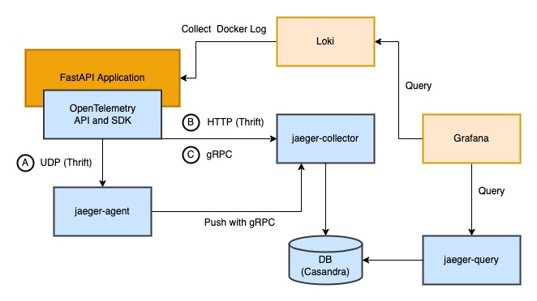

### Quick Start

1. Install [Loki Docker Driver](https://grafana.com/docs/loki/latest/clients/docker-driver/)

   ```bash
   docker plugin install grafana/loki-docker-driver:latest --alias loki --grant-all-permissions
   ```

2. Start all services with docker-compose

   ```bash
   docker-compose -f docker-compose-grafana.yaml up -d
   ```

   It may take some time for DB(Cassandra) to initialize. You can run `docker-compose ps` to check the `jaeger-query` status is running when DB is ready.

   If got the error message `Error response from daemon: error looking up logging plugin loki: plugin loki found but disabled`, please run the following command to enable the plugin:

   ```bash
    docker plugin enable loki
    ```

3. Send requests with `curl` to the FastAPI application

   ```bash
   curl http://localhost:8000/chain
   ```

4. Explore the collected span on Grafana [http://localhost:3000/](http://localhost:3000/) with default user `admin` and password `admin`

   Grafana Explore screenshot:

   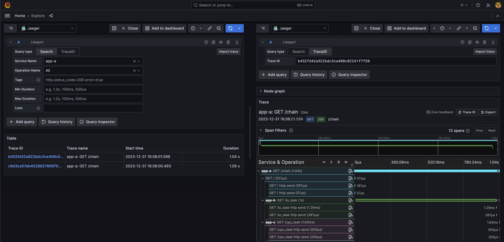

### Explore with Grafana

#### Traces to Logs

Get Trace ID and tags defined in Jaeger data source from span, then query with Loki.

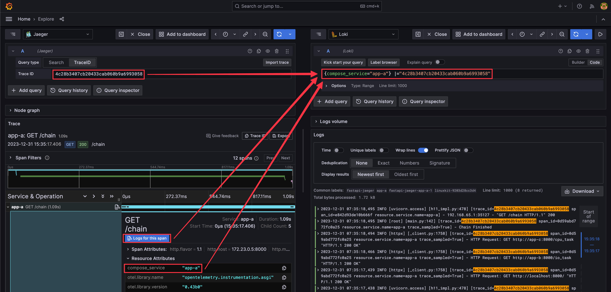

#### Logs to Traces

Get Trace ID pared from log (regex defined in Loki data source), then query in Jaeger.

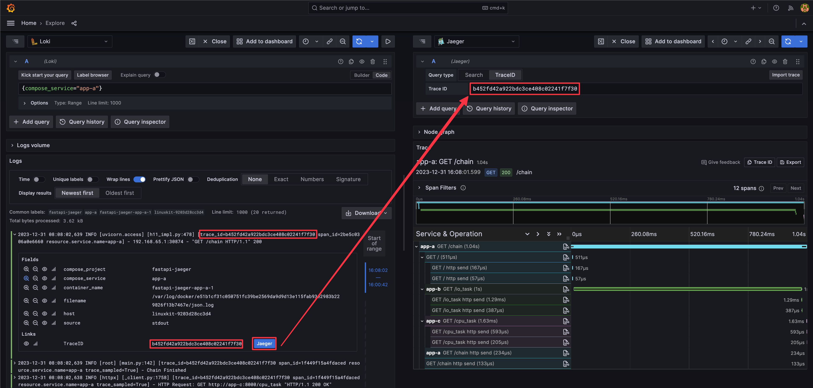

### Detail

#### Jaeger - Traces

Receives spans from applications.

##### Grafana Data Source

[Trace to logs](https://grafana.com/docs/grafana/latest/datasources/jaeger/#trace-to-logs) setting:

1. Data source: target log source
2. Tags: key of tags or process level attributes from the trace, which will be log query criteria if the key exists in the trace
3. Map tag names: Convert existing key of tags or process level attributes from trace to another key, then used as log query criteria. Use this feature when the values of the trace tag and log label are identical but the keys are different.

In this demo, we use Loki Docker Driver to collect logs from applications. The Loki Docker Driver will add the following labels to the log: `container_name`, `compose_project`, `compose_service`, `source`, `filename`, and `host`. We have to map an attribute from the trace to a label of the log to query the log with the trace information. So we add a tag `compose_service` through environment variable `OTEL_RESOURCE_ATTRIBUTES` to the trace, then map the tag `compose_service` to the label `compose_service` of the log.

```yaml
# docker-compose-grafana.yaml

services:
  app-a:
    image: ghcr.io/blueswen/fastapi-jaeger/app:latest
    depends_on:
      - loki
    ports:
      - "8000:8000"
    logging: *default-logging
    environment:
      MODE: "otlp-grpc"
      OTEL_SERVICE_NAME: "app-a"
      OTLP_GRPC_ENDPOINT: "otel-collector:4317"
      OTEL_RESOURCE_ATTRIBUTES: "compose_service=app-a"
```

The Jaeger data source setting in Grafana is as below:

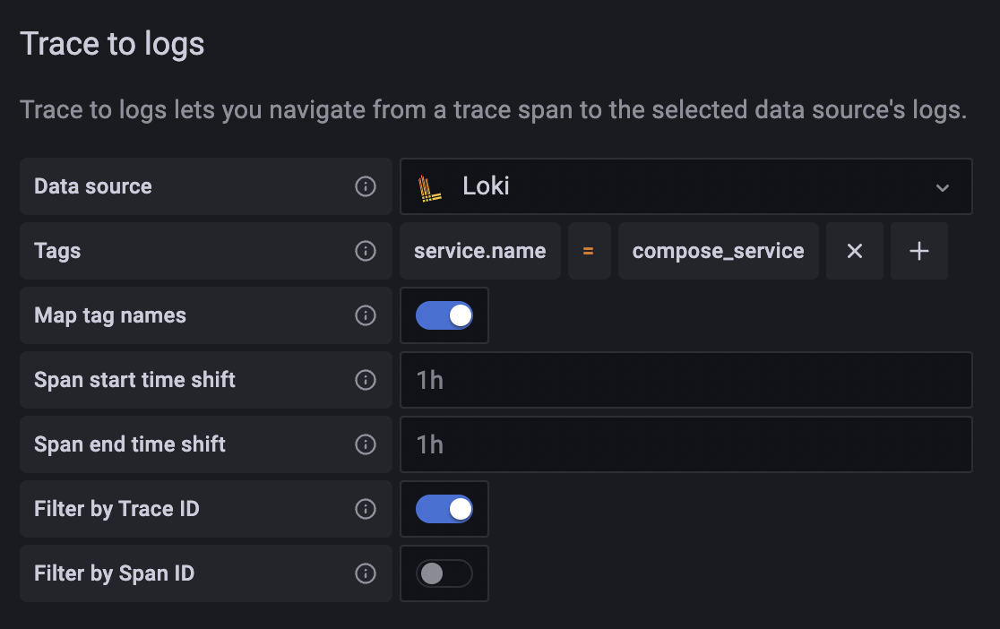

Which is produced by the following config file:

```yaml
# etc/grafana/datasource.yml
name: Jaeger
type: jaeger
typeName: Jaeger
access: proxy
url: http://jaeger-query:16686
user: ''
database: ''
basicAuth: false
isDefault: false
jsonData:
  nodeGraph:
    enabled: true
  tracesToLogs:
    datasourceUid: loki
    filterBySpanID: false
    filterByTraceID: true
    mapTagNamesEnabled: true
    mappedTags:
      - key: compose_service
```

#### Loki - Logs

Collects logs with Loki Docker Driver from applications.

##### Loki Docker Driver

1. Use [YAML anchor and alias](https://support.atlassian.com/bitbucket-cloud/docs/yaml-anchors/) feature to set logging options for each service.
2. Set [Loki Docker Driver options](https://grafana.com/docs/loki/latest/clients/docker-driver/configuration/)
   1. loki-url: loki service endpoint
   2. loki-pipeline-stages: processes multiline log from FastAPI application with multiline and regex stages ([reference](https://grafana.com/docs/loki/latest/clients/promtail/stages/multiline/))

```yaml
# docker-compose-grafana.yaml
x-logging: &default-logging # anchor(&): 'default-logging' for defines a chunk of configuration
  driver: loki
  options:
    loki-url: 'http://localhost:3100/api/prom/push'
    loki-pipeline-stages: |
      - multiline:
          firstline: '^\d{4}-\d{2}-\d{2} \d{1,2}:\d{2}:\d{2}'
          max_wait_time: 3s
      - regex:
          expression: '^(?P<time>\d{4}-\d{2}-\d{2} \d{1,2}:\d{2}:\d{2},d{3}) (?P<message>(?s:.*))$$'
# Use $$ (double-dollar sign) when your configuration needs a literal dollar sign.

version: "3.4"

services:
  foo: # sample service
    image: foo
    logging: *default-logging # alias(*): refer to 'default-logging' chunk 
```

##### Grafana Data Source

Add a TraceID derived field to extract the trace id and create a Jaeger link from the trace id.

Grafana data source setting example:

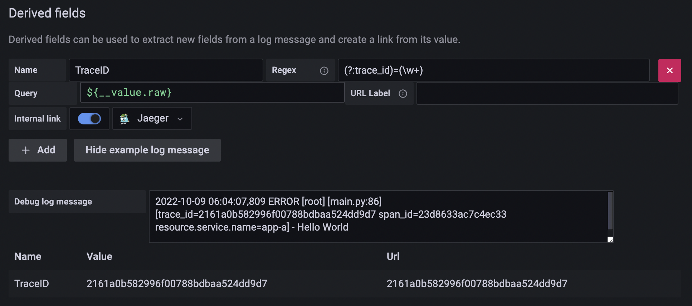

Grafana data source config example:

```yaml
# etc/grafana/datasource.yml
name: Loki
type: loki
typeName: Loki
access: proxy
url: http://loki:3100
password: ''
user: ''
database: ''
basicAuth: false
isDefault: false
jsonData:
derivedFields:
   - datasourceUid: jaeger
      matcherRegex: (?:trace_id)=(\w+)
      name: TraceID
      url: $${__value.raw}
      # Use $$ (double-dollar sign) when your configuration needs a literal dollar sign.
readOnly: false
editable: true
```

#### Grafana

1. Add Jaeger, and Loki to the data source with config file ```etc/grafana/datasource.yml```.

```yaml
# grafana in docker-compose-grafana.yaml
service:
  grafana:
    image: grafana/grafana:10.4.2
    ports:
      - "3000:3000"
    volumes:
      - ./etc/grafana/:/etc/grafana/provisioning/datasources
```

# Reference

1. [Jaeger](https://www.jaegertracing.io/)
2. [Official Jaeger docker compose example](https://github.com/jaegertracing/jaeger/blob/main/docker-compose/jaeger-docker-compose.yml)
3. [Official Jaeger with SPM docker compose example](https://github.com/jaegertracing/jaeger/tree/main/docker-compose/monitor)
4. [Difference between OpenTelemetry Collector and OpenTelemetry Collector Contrib](https://uptrace.dev/opentelemetry/collector.html#otelcol-vs-otelcol-contrib)
